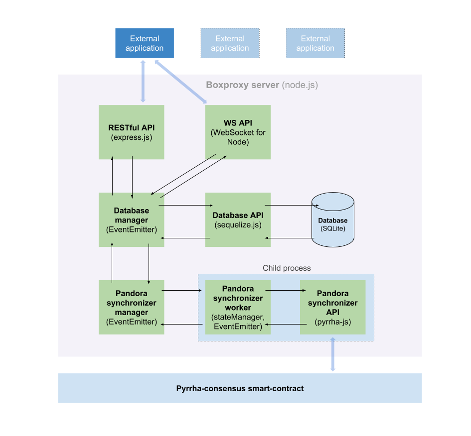

# Pyrrha-boxproxy architecture overview

## Description
Boxproxy is a database server and API wich representing and providing instant and fast access to data and states of the pyrrha-consensus smart-contract.  

## Use cases
- the external application gets an access to actual data and states of the pyrrha-consensus smart-contract entities (kernels, datasets, workers, jobs) without the need for special smart-contracts oriented software  
- the external application is searching thru data by searchable properties like address, description, state, etc.  
- the external application is sorting data by sortable properties like id, state, progress (etc.) in ascending or descending order  
- the external application receives real-time updates of data  

The external application makes requests via http and receives data in JSON format.

## Structure of the components  
  

